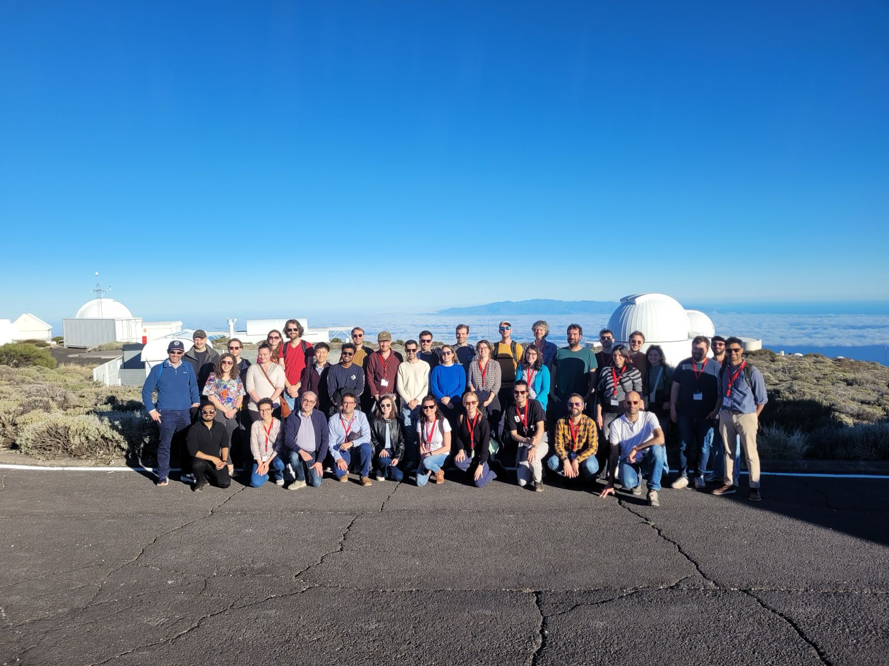

Welcome to the website for the CosmoForward meeting, which will be held during **9-12 February 2026** in Tenerife, Canary Islands, Spain.

- [Location](#location)
- [Programme](#programme)
- [Participants](#participants)

# Location

The meeting will be in San Cristóbal de La Laguna in Tenerife, hosted at the [Instituto de Astrofísica de Canarias • IAC](https://www.iac.es/en/about-us) .

# Programme
The meeting will focus on four themes: (1) modelling, (2) measuring and (3) simulating the Universe, and the (4) infrastructure work required for it. 
Below is a draft program summarising the talks, confirmed speakers, material we expect to cover, and split between <code style="color : SkyBlue">talks</code> and <code style="color : Darkorange">discussion</code>.

| Start Time | Mon Feb 9 | Tue Feb 10 | Wed Feb 11 | Thu Feb 12|
|---|---|---|---|---|
| 9:00 | **Coffee & chat** | **Coffee & chat** | **Coffee & chat** | **Coffee & chat** |
| 10:00 | <code style="color : SkyBlue">Welcome and Introduction</code> ([Calabrese])| <code style="color : SkyBlue">Measurement anchors in the early to mid Universe</code> ([Sherwin])| <code style="color : SkyBlue">New standard ingredients in cosmological analyses</code> ([Schmidt](talks/Schmidt_CosmoForward.pdf))| <code style="color : Grey">Breakout</code>|
| 10:30 | <code style="color : SkyBlue">Cosmology in 2025 </code> ([Hložek](talks/Hlozek_CosmoForward.pdf))| <code style="color : SkyBlue">Measurement anchors in the mid to late Universe </code> ([Hadzhiyska](talks/Hadzhiyska_CosmoForward.pdf))| <code style="color : SkyBlue">New standard astrophysical ingredients in cosmological analyses </code> ([Schaan]) |<code style="color : Grey"> Lab tour </code>|
| 11:00 | <code style="color : SkyBlue">Viable, physical and descriptive models of the early Universe </code> ([Gerbino](talks/Gerbino_CosmoForward.pdf)) | <code style="color : SkyBlue">External constraints on inflation theories </code> ([Braglia](talks/Braglia_CosmoForward.pdf)) | <code style="color : Darkorange">Discussion: targeting new measurements</code> ([Spinelli and Migliaccio](talks/Spinelli_Migliaccio_CosmoForward.pdf)) | <code style="color : Grey"> Lab tour </code>|
| 11:30 | <code style="color : SkyBlue">Viable, physical and descriptive models of the late Universe </code> ([Baker](talks/Baker_CosmoForward.pdf))|  <code style="color : SkyBlue">External constraints on matter components </code> ([Lattanzi](talks/Lattanzi_CosmoForward.pdf))| <code style="color : SkyBlue">Review of experiment likelihood frameworks:SO</code> ([Harrison](talks/Harrison_CosmoForward.pdf))| <code style="color : Grey">Breakout</code>|
| 12:00 | <code style="color : SkyBlue">Removal and marginalisation of well-known foregrounds </code> ([Beringue](talks/Beringue_CosmoForward.pdf))| <code style="color : SkyBlue">External constraints on Dark Energy theories </code> ([Burrage](talks/Burrage_CosmoForward.pdf))| <code style="color : SkyBlue">Review of experiment likelihood frameworks:DESC </code> ([Nicola](talks/Nicola_CosmoForward.pdf))| <code style="color : SkyBlue">Review of experiment likelihood frameworks:Euclid </code> ([Martinelli](talks/Martinelli_CosmoForward.pdf))|
| 12:30 | **Lunch (provided)** | **Lunch (provided)** | **Lunch (provided)** | **Lunch (provided)** |
| 14:00 | <code style="color : SkyBlue">Treatment of less-known foregrounds </code> ([Cepeda-Arriota](talks/Cepeda-Arroita_CosmoForward.pdf))| <code style="color : SkyBlue">Available simulations for cosmological analyses</code> ([Omori])| **<code style="color : Purple">Trip to observatory followed by social dinner</code>**| <code style="color : SkyBlue">Cross-correlation likelihoods, redundancy and use in combined cosmology </code> ([Fabbian](talks/Fabbian_CosmoForward.pdf))|
| 14:30 | <code style="color : SkyBlue">Removal and marginalisation of well-known CMB instrumental systematics </code> ([Duivenvoorden](talks/Duivenvoorden_CosmoForward.pdf))| <code style="color : SkyBlue">Missing components of current simulations </code> ([Madhavacheril])|  | <code style="color : SkyBlue">Inference sampling, speed and robustness </code> ([Ruiz Zapatero](talks/Ruiz-Zapatero_CosmoForward.pdf))|
| 15:00 | <code style="color : SkyBlue">Treatment of less-known CMB instrumental systematics </code> ([Atkins](talks/Atkins_CosmoForward.pdf))|  Continued |  |  <code style="color : SkyBlue">Added value of new methods </code> ([Balkenhol](talks/Balkenhol_CosmoForward.pdf))|
| 15:30 | **Coffee** | **Coffee** |  | **Coffee** |
| 16:00 |<code style="color : Darkorange">Discussion: community approaches to presentation of models </code> | <code style="color : Darkorange">Discussion: community approaches to measurement significance </code> ([Raveri])  |  | <code style="color : Darkorange">Discussion: mapping infrastructure requirements to funding</code>  |
| 16:45 | <code style="color : Darkorange">Discussion: viability of one-parameter extensions</code>  | <code style="color : Darkorange">Discussion: using simulations across multiple experiments </code> ([Lovell](talks/Lovell_CosmoForward.pdf )) |  | <code style="color : Darkorange">Discussion: cross-platform implementation: who and how? Code quality and openness </code>  |

# Participants
1. Erminia Calabrese
2. Ian Harrison
3. Serena Giardiello
4. Hidde Jense
5. Marc Vina
6. Tessa Baker
7. Matteo Martinelli
8. Clare Burrage
9. Lennart Balkenhol
10. Emmanuel Schaan
11. Andrina Nicola
12. Jaime Ruiz Zapatero
13. Adri Duivenvoorden
14. Zach Atkins
15. Massimiliano Lattanzi
16. Yuuki Omori
17. Blake Sherwin
18. Benjamin Beringue
19. Martina Gerbino
20. Giulio Fabbian
21. Renée Hložek
22. Roke Cepeda-Arroita
23. Ricardo T. Génova Santos
24. José Alberto Rubiño Martín
25. Boryana Hadzhiyska
26. Chris Lovell
27. Marta Spinelli
28. Matteo Braglia
29. Mat Madhavacheril
30. Emilio Bellini
31. Marina Migliaccio
32. Carlos Hernández-Monteagudo
33. Jorge Martín-Camalich
34. Alessandro Fasano
35. Ana Almedia
36. Kumar Aryan
37. Utsav Bose
38. Alba Crespo Pérez 
39. Mar Pérez-Sar 
40. Elena Vanetti
41. Francisco-Shu Kitaura 
42. Marco Raveri
43. Fabian Schmidt
44. Giacomo Galloni
